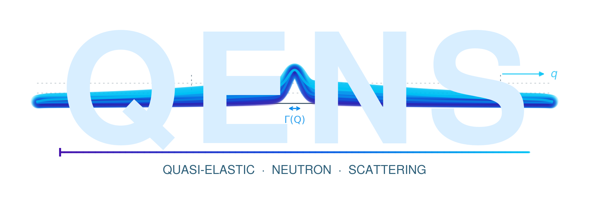

<p align="center">
  
</p>


# qens — Quasi-Elastic Neutron Scattering analysis

[](LICENSE)
[](https://www.python.org/)

End-to-end Python toolbox for analysing **Quasi-Elastic Neutron Scattering**
data from ISIS Mantid `.nxspe` files (IRIS, OSIRIS, LET, MARI, MAPS, …) and
any other Mantid-produced inelastic-spectrometer output.

The library is built around a clean separation between **physics models**
and **inference machinery**:

* The model catalogue includes Lorentzian and Gaussian primitives, three
  translational-diffusion HWHM models (Fickian, Chudley-Elliott,
  Singwi-Sjölander), and rotational structure factors (isotropic and
  anisotropic axial rotor, expanded to *l* = 2).
* These are combined into a full forward model
  S(Q, ω) = e<sup>−Q²⟨u²⟩/3</sup> · [translation x rotation] x resolution
  with a measured-kernel resolution path (use the frozen-sample
  S(Q, ω) directly — Lorentzian wings of real instruments don't fit a
  Gaussian).
* Inference is a joint-Q likelihood across **all** Q-bins simultaneously,
  with NNLS amplitude fitting per bin. MAP search is multi-start
  Nelder-Mead; MCMC is `emcee` (with a pure-NumPy Metropolis-Hastings
  fallback). Convergence diagnostics (autocorrelation time, Gelman-Rubin
  R̂) are reported automatically.
* Custom forward models can be registered without modifying core code —
  see [Custom models](#custom-models) below.

---

## Installation

```bash
pip install qens
# or, with the recommended sampler:
pip install "qens[mcmc]"
```

From source:

```bash
git clone https://github.com/your-org/qens
cd qens
pip install -e ".[mcmc]"
```

Dependencies: `numpy`, `scipy`, `h5py`, `matplotlib`. `emcee` is optional
(strongly recommended); without it the library falls back to a 4-chain
Metropolis-Hastings sampler.

---

## 60-second example

```python
from qens import (
    Config, load_dataset, fit_elastic_peak, assign_resolution,
    build_data_bins, build_resolution_bins,
    find_map, run_mcmc, summarise_samples,
)

cfg = Config(
    files_to_fit    = ["frozen_260K_Ei3.6.nxspe", "sample_290K_Ei3.6.nxspe"],
    primary_file    = "sample_290K_Ei3.6.nxspe",
    resolution_file = "frozen_260K_Ei3.6.nxspe",
    q_min=0.6, q_max=1.8, energy_window=1.25, n_q_bins=12,
)

dataset = load_dataset(cfg.files_to_fit, data_dir="data",
                       critical_files=[cfg.primary_file])
for d in dataset.values():
    fit_elastic_peak(d)
assign_resolution(dataset, cfg)

target     = dataset[cfg.primary_file]
resolution = dataset[cfg.resolution_file]
data_bins  = build_data_bins(target, cfg)
res_bins   = build_resolution_bins(resolution, cfg,
                                   q_centres=[b[3] for b in data_bins])

p_map, _   = find_map(data_bins, res_bins, model="anisotropic_rotor", cfg=cfg)
samples    = run_mcmc(data_bins, res_bins, p_map,
                      model="anisotropic_rotor", cfg=cfg)

# 95% CI for D*, ⟨u²⟩, D_t, D_s plus the anisotropy ratio
summarise_samples(
    samples,
    model="anisotropic_rotor",
    derived={"D_s/D_t": lambda s: s[:, 3] / s[:, 2]},
)
```

---

## Filename convention

`load_dataset` parses metadata from filenames following

```
<sample>_<temperature_K>_<Ei_x_100>_<kind>.nxspe
```

For example `benzene_290_360_inc.nxspe` ⇒ benzene, 290 K, Eᵢ = 3.60 meV,
incoherent measurement. `kind` is `inc` or `coh`.

If your files don't follow this convention, use
`read_nxspe_with_overrides(path, sample=…, temp=…, ei=…, kind=…)`.

---

## Two analysis pathways

### 1. Joint forward-model inference (recommended)

For systems with both translation and rotation (most molecular liquids),
fit all Q-bins jointly to a registered forward model. The Bessel-weight
ratios j₀(QR)² : j₁(QR)² : j₂(QR)² act as a **global** Q-constraint that
prevents the per-bin fit-degeneracies that classical analysis suffers from.

```python
data_bins = build_data_bins(target, cfg)
res_bins  = build_resolution_bins(resolution, cfg,
                                  q_centres=[b[3] for b in data_bins])
p_map, _  = find_map(data_bins, res_bins, model="anisotropic_rotor", cfg=cfg)
samples   = run_mcmc(data_bins, res_bins, p_map,
                     model="anisotropic_rotor", cfg=cfg)
```

Models bundled with the library:

| Name | n params | Parameters | When to use |
|---|---|---|---|
| `translation_only`   | 2 | D*, ⟨u²⟩                | atoms / monatomic ions, no rotation |
| `isotropic_rotor`    | 3 | D*, ⟨u²⟩, D_r           | rotation present, no anisotropy expected |
| `anisotropic_rotor`  | 4 | D*, ⟨u²⟩, D_t, D_s     | oblate axial rotors, e.g. benzene |

See `examples/01_full_anisotropic_pipeline.py` for the full workflow with
diagnostics and figures.

### 2. Classical per-Q HWHM extraction

Independent ‘elastic + Lorentzian’ fit per Q-bin, then fit Γ(Q) vs Q² to
a chosen model. Quick, simple, and the right choice for clean atomic /
ionic systems where rotation is absent.

```python
from qens import extract_hwhm
from scipy.optimize import curve_fit
from qens.models    import fickian_hwhm, ce_hwhm

q, gamma, gerr, eisf = extract_hwhm(target, cfg)
p, pcov = curve_fit(fickian_hwhm, q, gamma, sigma=gerr,
                    p0=[0.1], bounds=([1e-3], [3.0]))
print(f"Fickian D = {p[0]:.4f} ± {pcov[0,0]**0.5:.4f} Ų/ps")
```

See `examples/02_classical_hwhm_pipeline.py`.

---

## Resolution function — use a measured kernel

Real ISIS spectrometers have Lorentzian wings that don't fit a Gaussian.
The `build_resolution_bins` helper averages the frozen-sample S(Q, ω) over
each Q-bin to give a measured kernel that the forward model convolves with
the predicted shape. This is essential for accurate inference at low Q
where the kernel wings dominate the line shape.

```python
res_bins = build_resolution_bins(frozen_dataset, cfg,
                                 q_centres=[b[3] for b in data_bins])
# pass `res_bins` everywhere a `sigma_res` is expected
```

If no frozen sample is available you can pass a scalar Gaussian σ
(`d["sigma_res"]` after `assign_resolution`). The library will warn that
the resolution may be inflated.

---

## Custom models

Register your own forward model without touching the core source:

```python
import numpy as np
from scipy.signal           import fftconvolve
from qens                   import register_model
from qens.constants         import HBAR_MEV_PS
from qens.models.lineshapes import lorentz
from qens.models.forward    import _make_resolution_kernel

def predict_two_lorentzian(omega, q, params, sigma_res, **_):
    """Translational diffusion + a fast secondary mode."""
    D_slow, D_fast, frac_fast = params
    g_slow = HBAR_MEV_PS * D_slow * q*q
    g_fast = HBAR_MEV_PS * D_fast * q*q
    s = ((1 - frac_fast) * lorentz(omega, g_slow)
         +  frac_fast    * lorentz(omega, g_fast))
    kernel = _make_resolution_kernel(omega, sigma_res)
    return fftconvolve(s, kernel, mode="same") * (omega[1] - omega[0])

register_model(
    name        = "two_lorentzian",
    param_names = ("D_slow", "D_fast", "frac_fast"),
    prior_lo    = (1e-4, 1e-3, 0.0),
    prior_hi    = (1.0,  3.0,  1.0),
    predict     = predict_two_lorentzian,
)

# now usable everywhere
p_map, _ = find_map(data_bins, res_bins, model="two_lorentzian")
samples  = run_mcmc(data_bins, res_bins, p_map, model="two_lorentzian")
```

The custom model gets all of the inference machinery for free — joint-Q
likelihood, NNLS amplitude per bin, MAP search, MCMC, summary statistics,
publication figures.

---

## Customisation cheat-sheet

| What you want to change | How |
|---|---|
| Filename convention | `read_nxspe_with_overrides(path, sample=…, temp=…, ei=…, kind=…)` |
| Frozen-temp threshold | `Config(frozen_temp_threshold=200)` |
| Q range, ω window, # bins | `Config(q_min=…, q_max=…, energy_window=…, n_q_bins=…)` |
| MCMC walkers / steps | `Config(n_walkers=…, n_warmup=…, n_keep=…, thin=…)` |
| Random seed | `Config(random_seed=…)` |
| Output directory | `Config(save_dir=…)` |
| Resolution function | `Config(resolution_file="my_vanadium.nxspe")` |
| Molecule radius for rotor models | pass `radius=…` kwarg through `find_map` / `run_mcmc` |
| Add a new physical model | `register_model(...)` (see above) |
| Override a built-in's priors | `register_model("anisotropic_rotor", overwrite=True, prior_lo=…, prior_hi=…, …)` |

---

## Library layout

```
qens/
├── __init__.py             public API surface
├── config.py               Config dataclass
├── constants.py            physical constants
├── io.py                   .nxspe reader + Q-from-2θ
├── preprocessing.py        elastic-peak alignment, resolution assignment
├── models/
│   ├── __init__.py
│   ├── lineshapes.py       Lorentzian, Gaussian, lorentz_sum
│   ├── translation.py      Fickian, CE, SS HWHM
│   ├── rotation.py         isotropic + anisotropic rotor widths,
│   │                       spherical-Bessel weights
│   ├── forward.py          predict_sqw, ForwardModel dataclass
│   └── registry.py         register_model / get_model / available_models
├── fitting.py              binning, joint likelihood, MAP, classical HWHM
├── sampling.py             emcee + MH fallback, summary, R̂
└── plotting.py             publication figures
```

---

## Citing

If `qens` is useful in published work please cite the repository and (if
the anisotropic-rotor model is used) the underlying paper:

> Richardson H., McColl K., Nilsen G. J., Armstrong J., McCluskey A. R.,
> *Lost in Translation: Simulation-Informed Bayesian Inference Improves
> Understanding of Molecular Motion From Neutron Scattering*,
> arXiv:2603.06080 (2026).

---

## Contributing

Pull requests welcome. See `tests/` for the existing unit tests
(`pytest -v` to run). Style: `ruff check qens`. New physical models
should land in `qens/models/` and be registered in
`qens/models/registry.py`.

---

## License

MIT — see [LICENSE](LICENSE).
